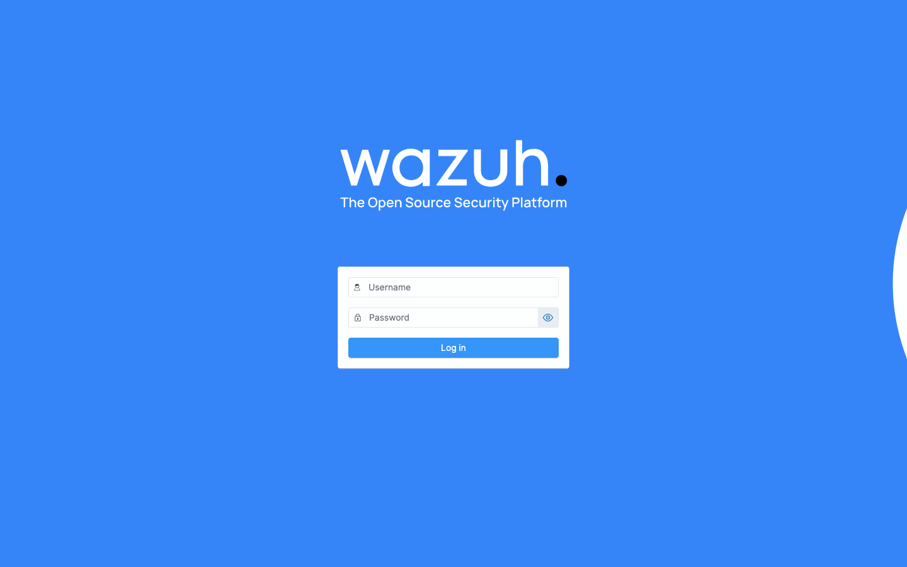
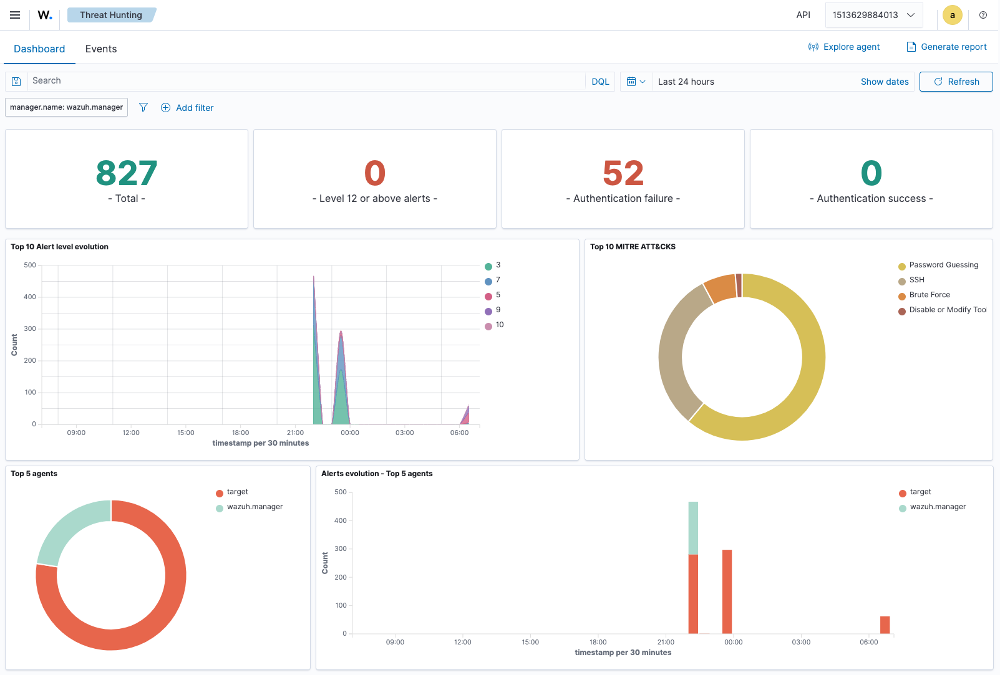
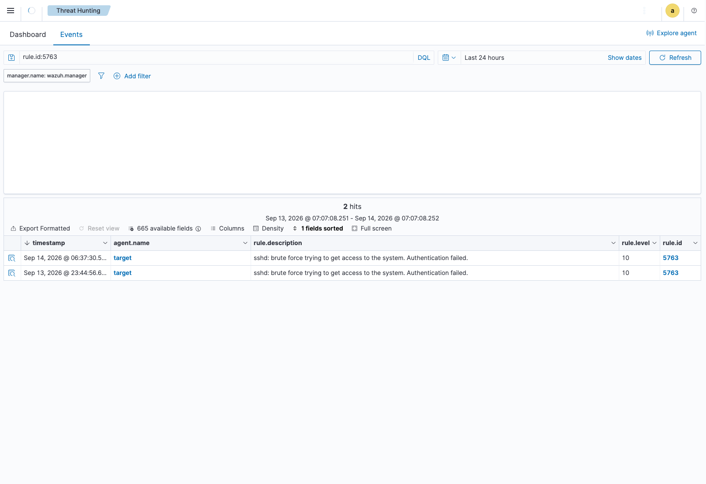
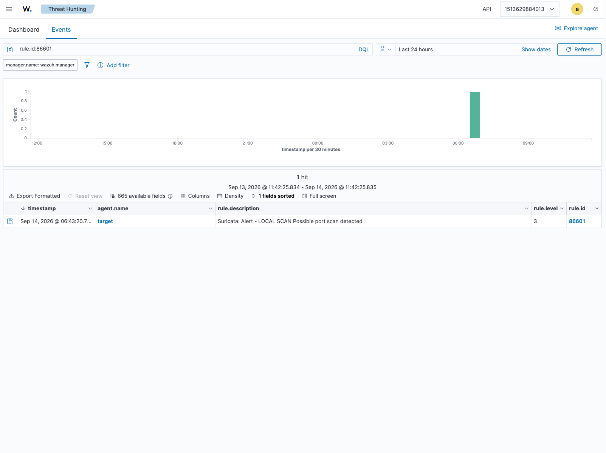

# Home SOC Lab

Status: both detection scenarios below are working end to end, with
screenshots and an explanation of why each alert fires.

A small, self-contained lab for practicing blue-team / SOC-analyst work: generating attack traffic against a test target and detecting it with a real SIEM, instead of only completing guided platform exercises.

## Stack

- **Wazuh** (manager + indexer + dashboard), official single-node Docker quickstart — [wazuh/](wazuh/)
- **Target container**: Ubuntu with OpenSSH (weak, deliberately breakable credentials) and a Wazuh agent — [target/](target/)
- **Suricata**, sharing the target's network namespace, feeding alerts to Wazuh through its built-in Suricata integration — [suricata/](suricata/)
- **Attacker tooling**: Hydra and Nmap, run against the target from outside its network namespace

Built and run on a throwaway cloud VM during development (snapshotted and
torn down between sessions), not a permanently hosted box — see the
project brief for why. Local-only would also work; this repo doesn't
assume either.

## Detection results

Last-24h view after running both scenarios below: MITRE ATT&CK breakdown
shows Password Guessing / Brute Force / SSH, and the alert-level timeline
shows the two separate bursts of activity.

### 1. SSH brute-force

**What was run:** repeated failed SSH logins against the target's
`labuser` account, which has a deliberately weak password.

**Why it fired:** the target's Wazuh agent tails `/var/log/auth.log`
(this needed adding by hand — Wazuh's default agent config doesn't watch
it out of the box; see [target/entrypoint.sh](target/entrypoint.sh)).
Each failed attempt is logged by PAM/sshd, and Wazuh's built-in decoders
match it against rule 5760 (`sshd: authentication failed`, level 5) —
that fires once per attempt. The alert above, rule **5763**
(`sshd: brute force trying to get access to the system`, level **10**),
is a correlation rule: it only fires once enough 5760s land from the
same source inside its time window. That distinction matters — a single
failed login isn't an incident, a burst of them from one source is, and
Wazuh's stock ruleset already draws that line without any custom rule.

### 2. Nmap scan

**What was run:** an Nmap SYN scan (`-sS -p-`) against the target from
outside its network namespace.

**Why it fired:** Suricata runs inside the target's network namespace and
sees every packet on `eth0`. The free Emerging Threats Open ruleset
(pulled via `suricata-update`) is built around known tool/traffic
fingerprints, not a generic scan detector, so a plain SYN scan against a
single-service host didn't match anything in it during testing. One
local rule was added using Suricata's own `threshold` keyword — a
built-in feature, not custom detection logic — to flag many SYN packets
from one source in a short window (see
[suricata/local.rules](suricata/local.rules) and
[suricata/README.md](suricata/README.md)). When that rule fires, Suricata
writes the alert to `eve.json`, which the target's Wazuh agent also
tails; Wazuh decodes it with its built-in Suricata integration
(rule **86601**), no custom Wazuh-side rule needed.

## Why

Practical follow-up to completing TryHackMe's Pre Security path (53 rooms). Guided rooms teach the tools; this lab is about building something that detects misuse of them, not just using them.
